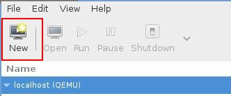
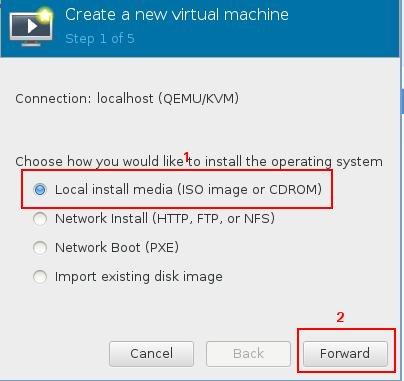
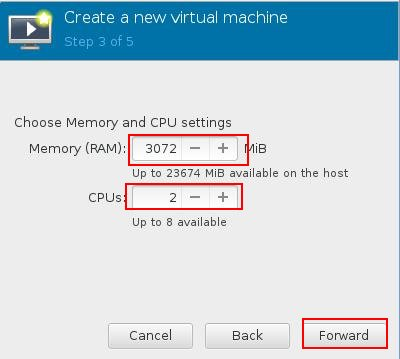
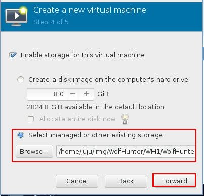
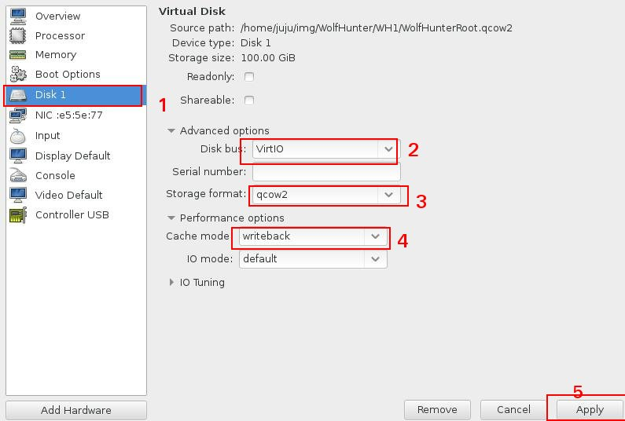
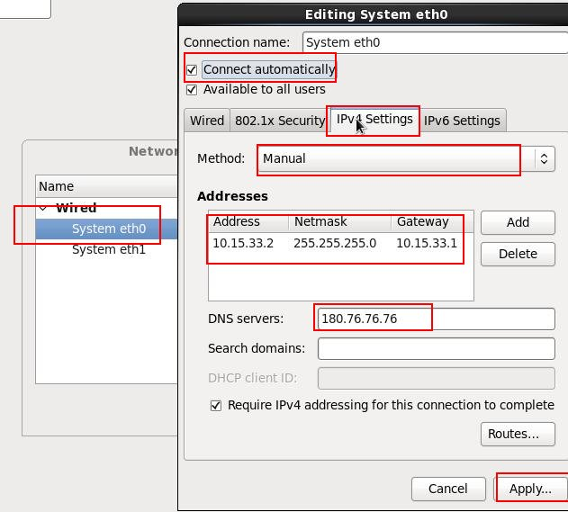
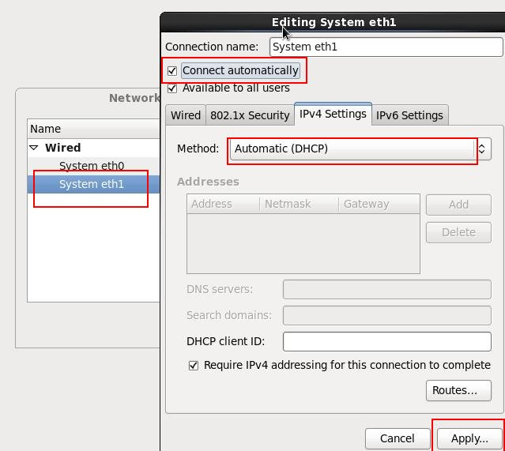

## WolfHunter Root Machine
We name the first deployed machine "Root Machine", because this machine is firstly introduced to the whole deployment environment, this machine acts as PXE Server, which will deploy all of the later added machine, and it holds all of the WolfHunter Ansible scripts which are used for deploying CloudStack environment.   

### Disk Preparation
Use following command for prepare the disk image file. 
```
# qemu-img create -f qcow2 WolfHunterRoot.qcow2 100G
```

### Machine Setup
Click "New" to create a new virtual machine:    
    
Choose "Local install media" and click "Forward":    
    
Select your downloaed CentOS6.6 DVD:    
   
Change the memory and cpu parameters:   
    
Specify the Disk File:   
    
Name the virtual machine, and check for customizatio(because later we have to add the network), click "Finish":    
    
Customize the Disk, for let it has the fastest speed:   
    
Add a new network card and assign it to Ext network:   
    
Modify the existing network for using the Inner network:   
    
Click "Begin Installation" for setup the machine.   

### Customize Network In System
Specify "Hostname" during setup:  
   
Click "Configure Network" and setup the 2 network:   
    
eth1 is for external network, setup it via:    
    
Select "Basic Server" for installation.   
