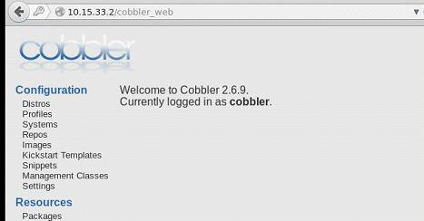

## Cobbler Web
Before we really move to deployment period, we'd better take a look at Cobbler Web interface and introduce its functionality in deployment.     
### Change Cobbler Web Password
Change the default login password of cobbler web:   
 
```
# cp /etc/cobbler/users.digest /etc/cobbler/users.digest.back
# htdigest /etc/cobbler/users.digest "Cobbler" cobbler
...
# service cobblerd restart 
```
Now login to cobbler web using your modified password, you will see following pages:    
    

In the Cobbler Web Backend you could do many operations, such as import DVDs, managing profiles/distros, etc.    

### End Of This Section
In this section we have login to the Cobbler Web Backend, using web interface we could easily manage the cobbler server's configuration.  

Later we will dive into Cobbler, but now let's hold on, switch to next chapter, we will import some DVDs for first time's deployment.   
