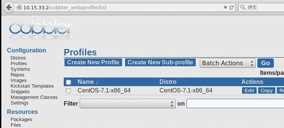

## Import ISOs
Before we using PXE Server for deploying systems, deployment content should be firstly imported into the Cobbler server. In this section we will import CentOS7.1 DVD and CentOS6.5 DVDs into Cobbler Server.   

### Import CentOS7.1
First you should download the CentOS7.1 DVD to local disk, then follow steps for importing it into Cobble Server:   

1\. Mount it to specified directory:  

```
# mount -t iso9660 -o loop ./CentOS-7-x86_64-Everything-1503-01.iso /mnt1/
```

2\. Import it to Cobbler Server, and specify its profile name:   

```
# cobbler import --name=CentOS-7.1 --arch=x86_64 --path=/mnt
```

3\. Check the import result via:   

```
# cobbler profile list
CentOS-7.1-x86_64
# cobbler distro list
CentOS-7.1-x86_64
```

You can also the result in the Cobbler Web backend:   

  

### Import CentOS6.5
CentOS6.5 has 2 DVDs, so we import them using following steps:    

1\. Mount 2 DVDs to different directories:   

```
# mount -t iso9660 -o loop ./CentOS-6.5-x86_64-bin-DVD1.iso /mnt1/
# mount -t iso9660 -o loop ./CentOS-6.5-x86_64-bin-DVD2.iso /mnt2/
```  

2\. First import DVD1 into Cobbler:    

```
# cobbler import --name=CentOS-6.5 --arch=x86_64 --path=/mnt
```

3\. Use following commands for importing the second DVD:     

```
# rsync -a '/mnt2/' /var/www/cobbler/ks_mirror/CentOS-6.5-x86_64/ --exclude-from=/etc/cobbler/rsync.exclude --progress
# COMPSXML=$(ls /var/www/cobbler/ks_mirror/CentOS-6.5-x86_64/repodata/*comps*.xml)
# createrepo -c cache -s sha --update --groupfile ${COMPSXML} /var/www/cobbler/ks_mirror/CentOS-6.5-x86_64
```

4\. Check the result now you could see:  

```
# cobbler profile list
CentOS-6.5-x86_64
CentOS-7.1-x86_64
# cobbler distro list
CentOS-6.5-x86_64
CentOS-7.1-x86_64
```

### End Of This Section
In this section we have imported 2 distros into the cobbler system. Now Cobbler Server is ready for deploying the CentOS6.5 and CentOS7.1. 

In next section we will deploy our first node in PXE.   
