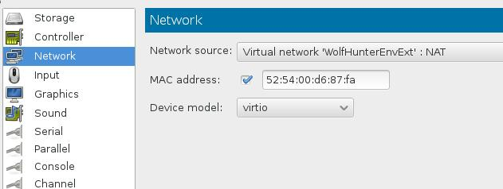
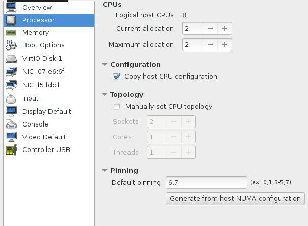
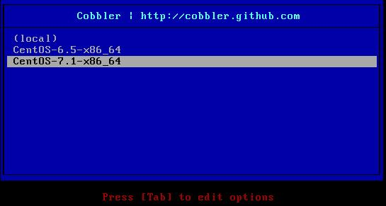

## Node Preparation
In this section we will prepare 2 nodes for CloudStack Deploymet, one for deploying CloudStack Management Node, the second is for CloudStack Agent Node.    

### CloudStack Management Node
#### Parameter
OS: CentOS 6.5      
Mem: 3072MB(3G)    
CPU: 2-Core    
Disk: 100G   
Network: Inner+External    

#### Add External Network
We use the WolfHunterFirstNode machine, first we power down this machine, add the second ethernet card.    
   
Power on this machine again. The newly added ethernet could not get the ip address, because we didn't set it in sysconfig, edit its configuration.     

```
# cd /etc/sysconfig/network-scripts/
# cp ifcfg-eth0 ifcfg-eth1
# vim ifcfg-eth1
DEVICE="eth1"
BOOTPROTO="dhcp"
IPV6INIT="yes"
MTU="1500"
NM_CONTROLLED="yes"
ONBOOT="yes"
TYPE="Ethernet"
# reboot
```

After reboot you could check eth1 is avaiable in the system, and it has the Externel network IP address assigned.   

```
# ifconfig eth1
eth1      Link encap:Ethernet  HWaddr 52:54:00:D6:87:FA  
          inet addr:10.15.34.146  Bcast:10.15.34.255  Mask:255.255.255.0
```
#### Repository 
Since CentOS6.5 is out-of-date, we have to use CentOS Vault repository for getting the packages, if we use the CentOS-Base, then this distribution may upgrade to CentOS6.5 automatically. We move all of the CentOS predefined repo files into another position and use our defined repo file for updating.     

```
# mv /etc/yu.repos.d/CentOS* /root/
# vim /etc/yum.repos.d/CentOS-Vault.repo 
[C6.5-base]
name=CentOS-6.5 - Base
baseurl=http://vault.centos.org/6.5/os/$basearch/
gpgcheck=1
gpgkey=file:///etc/pki/rpm-gpg/RPM-GPG-KEY-CentOS-6
enabled=1

[C6.5-updates]
name=CentOS-6.5 - Updates
baseurl=http://vault.centos.org/6.5/updates/$basearch/
gpgcheck=1
gpgkey=file:///etc/pki/rpm-gpg/RPM-GPG-KEY-CentOS-6
enabled=1

[C6.5-extras]
name=CentOS-6.5 - Extras
baseurl=http://vault.centos.org/6.5/extras/$basearch/
gpgcheck=1
gpgkey=file:///etc/pki/rpm-gpg/RPM-GPG-KEY-CentOS-6
enabled=1

[C6.5-contrib]
name=CentOS-6.5 - Contrib
baseurl=http://vault.centos.org/6.5/contrib/$basearch/
gpgcheck=1
gpgkey=file:///etc/pki/rpm-gpg/RPM-GPG-KEY-CentOS-6
enabled=1

[C6.5-centosplus]
name=CentOS-6.5 - CentOSPlus
baseurl=http://vault.centos.org/6.5/centosplus/$basearch/
gpgcheck=1
gpgkey=file:///etc/pki/rpm-gpg/RPM-GPG-KEY-CentOS-6
enabled=1
```
If the download speed from `vault.centos.org` is slow, you can change to `http://archive.kernel.org/centos-vault/6.5/` for better speed.    
Epel Repository could be imported in following:    

```
# wget -O /etc/yum.repos.d/epel.repo http://mirrors.aliyun.com/repo/epel-6.repo
```

CloudStack Repository should be imported like following, suppose we use version `4.5.1` of CloudStack.   

```
# vim /etc/yum.repos.d/cloudstack.repo
[cloudstack]
name=cloudstack
baseurl=http://cloudstack.apt-get.eu/centos7/4.5/
enabled=1
gpgcheck=0
```

### CloudStack Agent Node
#### Parameter
OS: CentOS 7.1     
Mem: 3072MB(3G)    
CPU: 2-Core(With KVM acceleration enabled)    
Disk: 100G   
Network: Inner+External    

#### Create Machine
CloudStack Agent Node runs on CentOS7.1, thus we created a new kvm machine, as we described in chapter 2( 2.4 Deploy Your First Node). 

This node need the CPU support kvm acceleration, so when creating the kvm machine, we setup the CPU parameter like following.   
   

In PXE menu, select CentOS7.1 related item:    
    

Press enter and waiting for installation finished.  

#### Network Configuration 
The network info could be viewed via:    

```
# ip addr 
1: lo: <LOOPBACK,UP,LOWER_UP> mtu 65536 qdisc noqueue state UNKNOWN 
    link/loopback 00:00:00:00:00:00 brd 00:00:00:00:00:00
    inet 127.0.0.1/8 scope host lo
       valid_lft forever preferred_lft forever
    inet6 ::1/128 scope host 
       valid_lft forever preferred_lft forever
2: eth0: <BROADCAST,MULTICAST,UP,LOWER_UP> mtu 1500 qdisc pfifo_fast state UP qlen 1000
    link/ether 52:54:00:f5:fd:cf brd ff:ff:ff:ff:ff:ff
    inet 10.15.34.226/24 brd 10.15.34.255 scope global dynamic eth0
       valid_lft 3526sec preferred_lft 3526sec
    inet6 fe80::5054:ff:fef5:fdcf/64 scope link 
       valid_lft forever preferred_lft forever
3: eth1: <BROADCAST,MULTICAST,UP,LOWER_UP> mtu 1500 qdisc pfifo_fast state UP qlen 1000
    link/ether 52:54:00:07:e6:6f brd ff:ff:ff:ff:ff:ff
    inet 10.15.33.7/24 brd 10.15.33.255 scope global dynamic eth1
       valid_lft 21527sec preferred_lft 21527sec
    inet6 fe80::5054:ff:fe07:e66f/64 scope link 
       valid_lft forever preferred_lft forever
```
There won't be some special configuration, cause we added the hardware at the very beginning, the system has setup the address automatically.   

#### Repository Configuration
Since CentOS7.1 is the newest version, we needn't setup the repository. But we also have to setup the epel repository and cloudstack repository.    

Epel Repository:   

```
# yum install -y wget vim
# wget -O /etc/yum.repos.d/epel.repo http://mirrors.aliyun.com/repo/epel-7.repo
```

CloudStack Repository:    

```
# vim /etc/yum.repos.d/cloudstack.repo
[cloudstack]
name=cloudstack
baseurl=http://cloudstack.apt-get.eu/centos7/4.5/
enabled=1
gpgcheck=0
```
Verify your repo configuration via:    

```
# yum makecache
# yum search cloudstack
```

### End Of This Section
By now we have setup the 2 nodes which are ready for deploying CloudStack components. In following sections we will begin to deploy components in these 2 nodes.     
