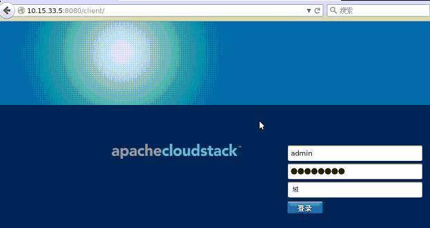
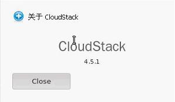

## CloudStack Management
Login to `10.15.33.5`, we will start the deployment of the CloudStack Management Node.    

More detailed documentation could be found at:   
[http://cloudstack-installation.readthedocs.org/en/latest/qig.html](http://cloudstack-installation.readthedocs.org/en/latest/qig.html)   

### Change Network Information
Without correct hostname, your deployment may meet some strange problems, so first we have to modify hostname via following steps:   

```
# vim /etc/hostname 
CSMgmt
# vim /etc/hosts
127.0.0.1   localhost localhost.localdomain localhost4 localhost4.localdomain4
::1         localhost localhost.localdomain localhost6 localhost6.localdomain6
+ 127.0.0.1   CSMgmt
+ 10.15.33.5   CSMgmt
``` 
After reboot, verify hostname via:    

```
# hostname --fqdn
CSMgmt
```

### Installation Steps
#### 1. Install and Configure NTP:    

```
# yum install -y ntp
# vim /etc/ntp.conf
    driftfile /var/lib/ntp/drift
    
    restrict default kod nomodify notrap nopeer noquery
    restrict -6 default kod nomodify notrap nopeer noquery
    
    restrict 127.0.0.1 
    restrict -6 ::1
    
    server 0.uk.pool.ntp.org iburst
    server 1.uk.pool.ntp.org iburst
    server 2.uk.pool.ntp.org iburst
    server 3.uk.pool.ntp.org iburst
    
    includefile /etc/ntp/crypto/pw
    
    keys /etc/ntp/keys
    
    disable monitor
# service ntp restart
# chkconfig ntp on
``` 

#### 2. SELinux Related configuration:    
Install libselinux-python:  

```
# yum install -y libselinux-python
```

Configure SELinux:   

```
# vim /etc/selinux/config
SELINUX=permissive
SELINUXTYPE=targeted
```
After configurating SELinux, you'd better restart machine to let policy take effects.   

#### 3. MySQL
Install MySQL via:   

```
# yum install -y mysql-server
```
Install MySQL python module:    

```
# yum install -y MySQL-python
```
Configure MySQL's my.cnf file, add the following items before `[mysqld_safe]`:   

```
# vim /etc/my.cnf
    + # CloudStack MySQL settings
    + innodb_rollback_on_timeout=1
    + innodb_lock_wait_timeout=600
    + max_connections=700
    + log-bin=mysql-bin
    + binlog-format = 'ROW'
    + bind-address=0.0.0.0
    
    [mysqld_safe]
``` 
Start and enable the mysqld server:    

```
# service mysqld start
# chkconfig mysqld on
```
Remove anonymous user:    

```
# mysql
mysql>  SELECT User, Host, Password FROM mysql.user;
+------+-----------+----------+
| User | Host      | Password |
+------+-----------+----------+
| root | localhost |          |
| root | csmgmt    |          |
| root | 127.0.0.1 |          |
|      | localhost |          |
|      | csmgmt    |          |
+------+-----------+----------+
mysql> DROP USER ''@'csmgmt'; 
mysql> DROP USER ''@'localhost'; 
mysql>  SELECT User, Host, Password FROM mysql.user;
+------+-----------+----------+
| User | Host      | Password |
+------+-----------+----------+
| root | localhost |          |
| root | csmgmt    |          |
| root | 127.0.0.1 |          |
+------+-----------+----------+
3 rows in set (0.00 sec)
```
Remove the testdb:   

```
mysql> select * from mysql.db;
........
mysql> DELETE FROM mysql.db WHERE Db LIKE 'test%';
Query OK, 2 rows affected (0.00 sec)

mysql> select * from mysql.db;
Empty set (0.00 sec)
mysql> DROP DATABASE test;
Query OK, 0 rows affected (0.00 sec)

mysql> FLUSH PRIVILEGES;
Query OK, 0 rows affected (0.00 sec)
mysql> \q
Bye
```
Secure MySQL installation and change root user password, in fact all of the above configuration could be done here:   

```
# mysql_secure_installation
```
Enable the iptables:    

```
# iptables -A INPUT -p tcp -m tcp --dport 3306 -j ACCEPT
# vim /etc/sysconfig/iptables
+ 	-A INPUT -p tcp -m tcp --dport 3306 -j ACCEPT
	-A FORWARD -j REJECT --reject-with icmp-host-prohibited
COMMIT
# service ntpd restart
```

#### 4. Install CloudStack-Management
Install cloudstack management packages via:   

```
# yum install -y cloudstack-management
```

#### 5. Install Cloud-Monkey    
Cloud-Monkey is for quickly configurating CloudStack, install it via:    

```
# yum install -y python-pip
# pip install cloudmonkey
```

#### 6. Configure CloudStack Database

```
cloudstack-setup-databases cloud:engine@localhost --deploy-as=root:engine -i 10.15.33.5>>/root/cs_dbinstall.out 2>&1
```

#### 7.  Configure Management server

```
# cloudstack-setup-management >> /root/cs_mgmtinstall.out 2>&1
```

By now you could visit the Management node via:     

```
# firefox http://10.15.33.5:8080/client/
```

   

Username/Password is admin/password.   

You could check the version of the installed management node version:    
    

### End Of This Section
By walking through this section we have installed CloudStack Management Node in CentOS6.5 based node. Next section we will install CloudStack Agent Node on CentOS7.1.       
