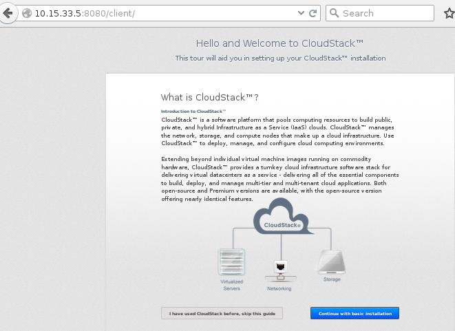
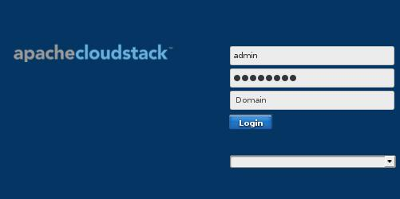
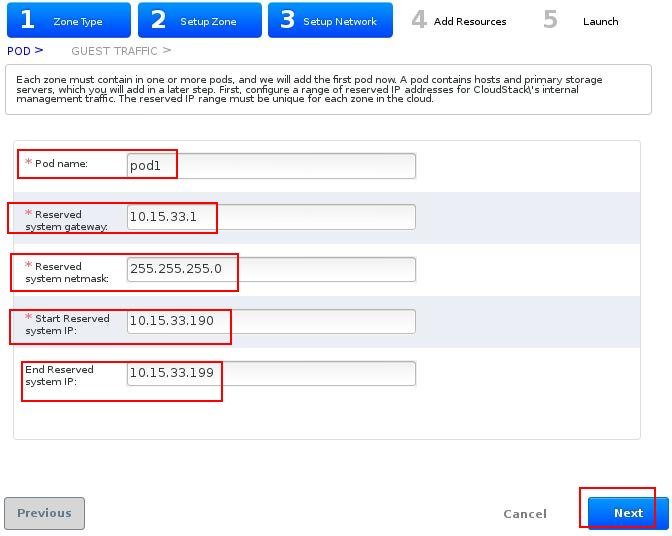
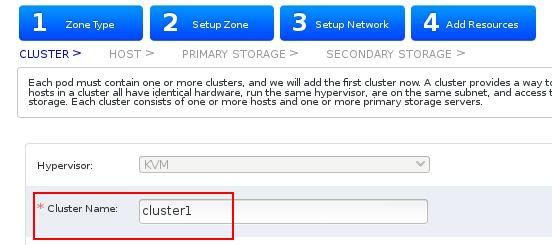
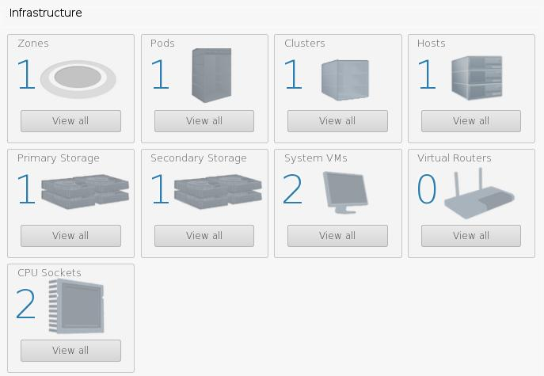

## Configure CloudStack

### Change Login Password
The first time you login to the installed CloudStack Management node, you will see following webpage:    
   

Click `Continue with basic installation`, set the password:    
    

At this point, refresh your browser, and you see the login window again, use your newly modified password for login:    
  

After login you will see the same webpage which asks you follow with guide or not, we select `I have used CloudStack before, skip this guide`  button and continue with next setup.    

Your webpage listed as following:    
   

### CloudStack Global Options
Since we want to use local storage, we have to do following configuration for enable Local Storage. 

Hit `Global Options` button and type in `local` for searching:    
   

Change the value `system.vm.usel` to `true:    
    

Restart Cloudstack-management service
```
# service cloudstack-management restart
```

### Infrasturcture Configuration
Click `Infrasturcture`, and you will see nothing has been configured yet.    
    

Click `View All` button under `zone`:   


Click `Add zone` button:   
   

Select Zone Type:   
    

Configure Zone Info:   
    

   

Click Next and click Next again to step `4 Add Resources`, configure the start/end IP Arrange:    
    

Continue configure Guest Traffic:  
     

Configure cluster name:   
    

Add host:   
   

Add Secondary Storage:   
   

Hit Launch , and you will see zone/pod created, host has been added into cluster.     
    

### End Of The Section
Now the cloudstack manually deployment finished, in next section we will discuss on how to use CloudMonkey for automatically create zone/pod/cluster.   
