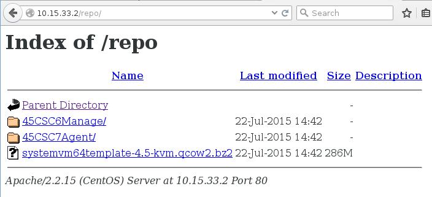

## Create Local Repo

### Generate repo
We decide to create the repo on Cobbler Server, thus we first upload the packages we downloaded in last section to Cobbler Server, place them under specified folder.    

```
# ls -F
45CSC6Manage/  45CSC7Agent/  systemvm64template-4.5-kvm.qcow2.bz2*
```

45CSC6Manage is the repository for CentOS6.5 Based CloudStack Management Node.     
45CSC7Agent is the repository for CentOS7.5 Based CloudStack Agent Node.     
systemvm64template-4.5-kvm.qcow2.bz2 is the template file for kvm.   

Create repo via:    

```
#  cd 45CSC6Manage/
#  createrepo  .
#  cd ../45CSC7Agent/
#  createrepo  .
``` 
Now a new folder named `repodata` will be available under your specified directory.   

### Make repo accessible via web 
Cobbler Server has enabled the apache server by default, but we have to enable the follow links options via:    

```
# vim /etc/httpd/conf/httpd.conf
<Directory "/var/www/html">
    Options Indexes FollowSymLinks
# service httpd restart
```
By adding this you could enable the indexes of the folder via httpd.   

Now Copy the repo/ folder under /var/www/html, open a browser and visit `http://10.15.33.2/repo/`, you will found the repo listed info:    

   
 
### End Of The Section
In this section we have set the local repository which holds all of the installation files, using these files we could easily setup the new nodes in isolated networking environment, so in next section we will use this new repository for deploying a new Mgmt/Agent for testing.    
