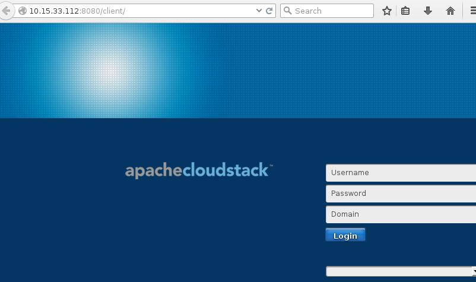

## Deploy CS Management
We won't talk too much on how to write and debug the ansible playbook. We just record the steps for using ansible playbooks here. 

The whole playbook will be listed in single sections.  

### Preparation
PXE Boot a new machine, which have installed CentOS6.5, another machine which will install CentOS7.1.    
Disk file:   
```
# qemu-img create -f qcow2 WolfHunterAnsibleMgmt.qcow2 100G
# qemu-img create -f qcow2 WolfHunterAnsibleAgent.qcow2 100G
```  

### Configuration
Change the host file:   

```
# vim /root/Code/Ansible/WolfHunterHosts
[WolfHunterAnsibleMgmt]
10.15.33.106
```
Install ssh-key and verify no-password login:    

```
# ssh root@10.15.33.106
The authenticity of host '10.15.33.106 (10.15.33.106)' can't be established.
RSA key fingerprint is 05:25:bf:98:89:5c:e7:4e:1a:75:44:ad:18:be:1d:b2.
Are you sure you want to continue connecting (yes/no)? yes
Warning: Permanently added '10.15.33.106' (RSA) to the list of known hosts.
root@10.15.33.106's password: 

# ansible-playbook addkey.yml --ask-pass
# ssh root@10.15.33.106
Last login: Wed Jul 22 08:14:06 2015 from 10.15.33.2
[root@localhost ~]# 
```

### Ansible It!!! 

```
# ansible-playbook 45CSManagement.yml

PLAY [CloudStack Installation Playbook(Version 4.5)] ************************** 

GATHERING FACTS *************************************************************** 
ok: [10.15.33.112]
......
```

Once deployment finished, the cloudstack management node is listed as:    
   

### End Of The Section
By using Ansible for deploying CloudStack is pretty easy, in next section we will display all of the playbooks content.     
